# Deliverable 2 – Design & Prototype Documentation
## iTradeZA C2C E-Commerce Platform

**Student Submission**  
**Platform:** Consumer-to-Consumer (C2C) E-Commerce  
**Technologies:** HTML5, CSS3 (Bootstrap 5.3.3), JavaScript (jQuery 3.7.1), PHP 8, MySQL 8.0  

---

## 2.1 Introduction

This document presents the complete design, prototyping, and technical documentation for **iTradeZA**, a Consumer-to-Consumer (C2C) e-commerce platform developed to facilitate secure and efficient trade between individual consumers in South Africa. The platform specifically addresses the needs of South Africa's informal/township economy, enabling small-scale traders and "side-hustlers" to digitise their businesses.

The system comprises two core components:
1. **Main Customer Website** — enabling buyers to browse, purchase, and communicate; and sellers to list products, manage orders, and receive payments.
2. **Admin Website** — providing full platform management through Role-Based Access Control (RBAC), supporting CRUD operations on users, products, orders, and roles.

The platform is built using **HTML5, CSS3 (Bootstrap 5), JavaScript (jQuery), PHP 8, and MySQL 8.0** — meeting all technical requirements specified in the project brief. Every page is fully responsive across smartphones (375px), tablets (768px), and desktops (1920px).

---

## 2.2 Prototyping

### a. Main Website — Responsive Prototypes

The main website is built mobile-first using Bootstrap 5's responsive grid system. Below are screenshots demonstrating the responsive layout across all three device sizes.

#### Home Page

| Desktop (1920×1080) | Tablet (768×1024) | Mobile (375×812) |
|:---:|:---:|:---:|
| 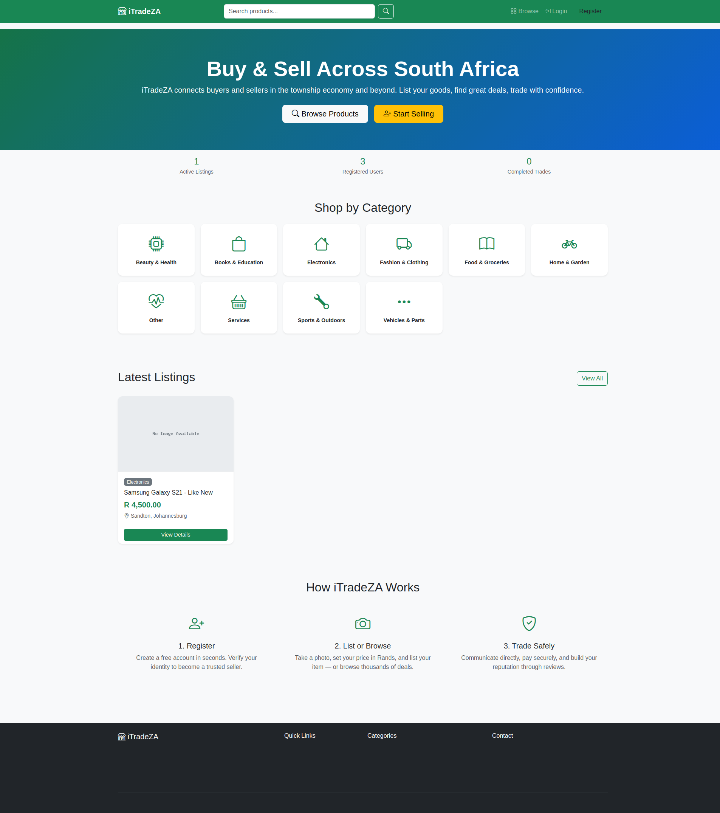 | 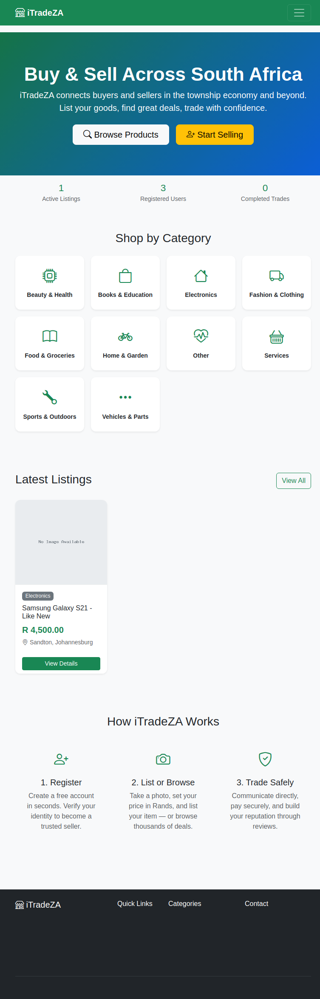 | 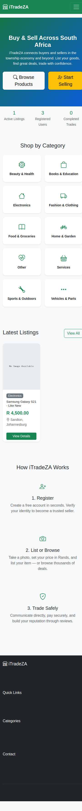 |

**Responsive Features:**
- Hero banner adapts from full-width gradient to stacked mobile layout
- Category grid adjusts from 6 columns → 3 columns → 2 columns
- Navigation collapses to hamburger menu on mobile
- Stats bar remains horizontally centered across all sizes

#### Browse/Search Page

| Desktop | Tablet | Mobile |
|:---:|:---:|:---:|
| 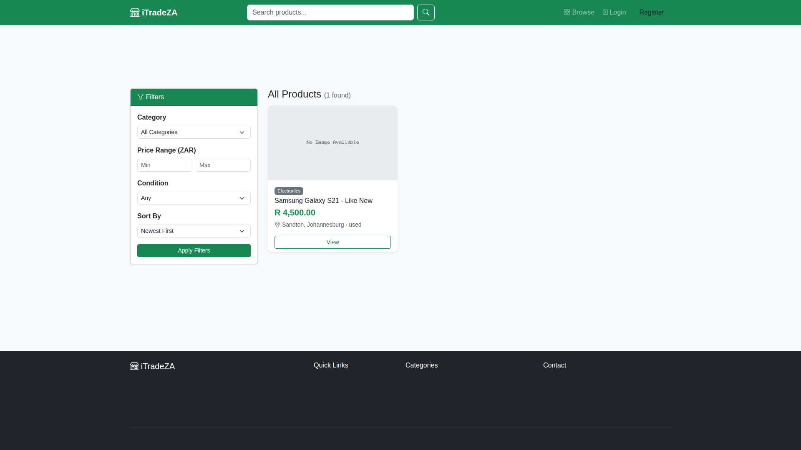 | 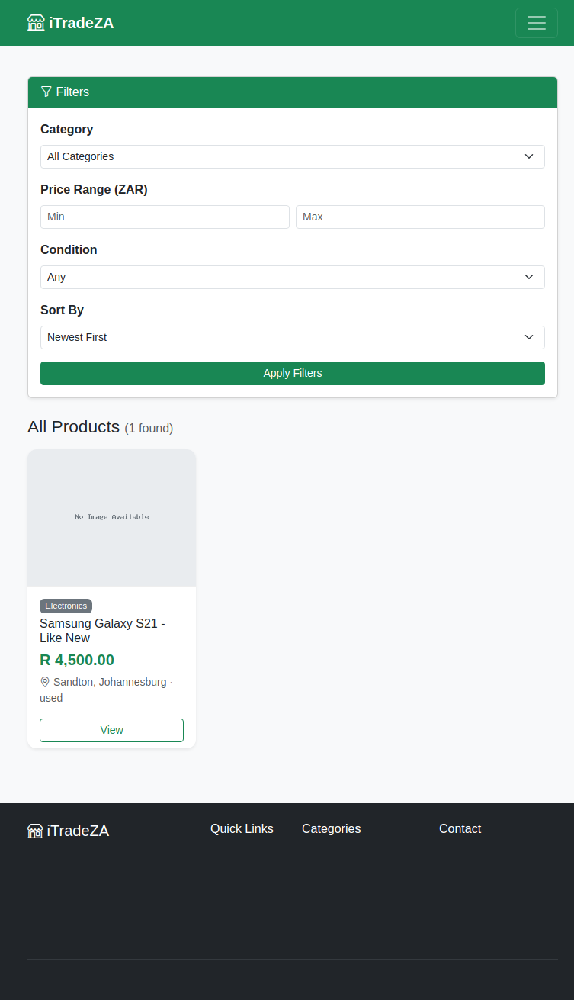 | 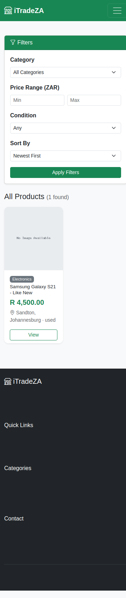 |

**Responsive Features:**
- Filter sidebar collapses above product grid on smaller screens
- Product grid: 3 columns → 2 columns → 1 column
- Pagination adapts to available width

#### Product Detail Page

| Desktop | Tablet | Mobile |
|:---:|:---:|:---:|
| 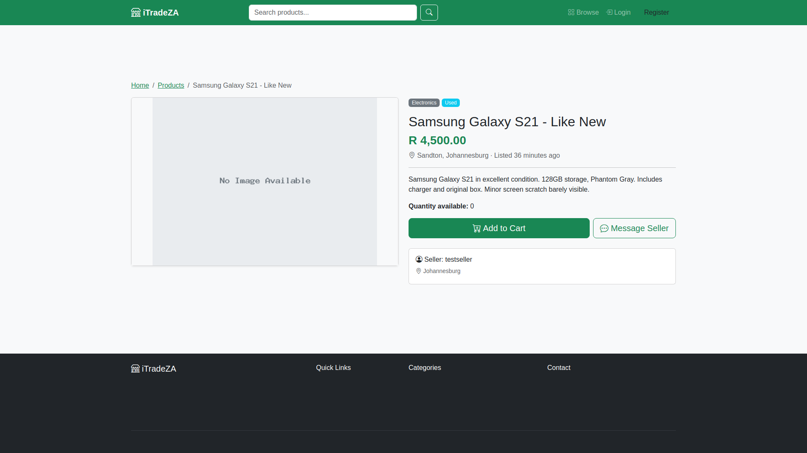 | 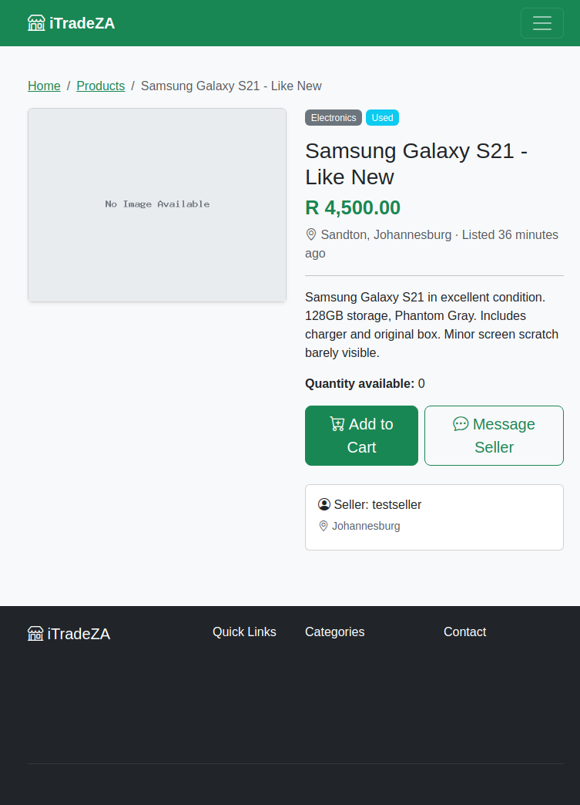 | 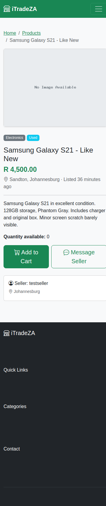 |

**Responsive Features:**
- Side-by-side layout (image + details) stacks vertically on mobile
- "Add to Cart" and "Message Seller" buttons become full-width on mobile
- Breadcrumb navigation wraps gracefully

#### Login Page

| Desktop | Tablet | Mobile |
|:---:|:---:|:---:|
|  | 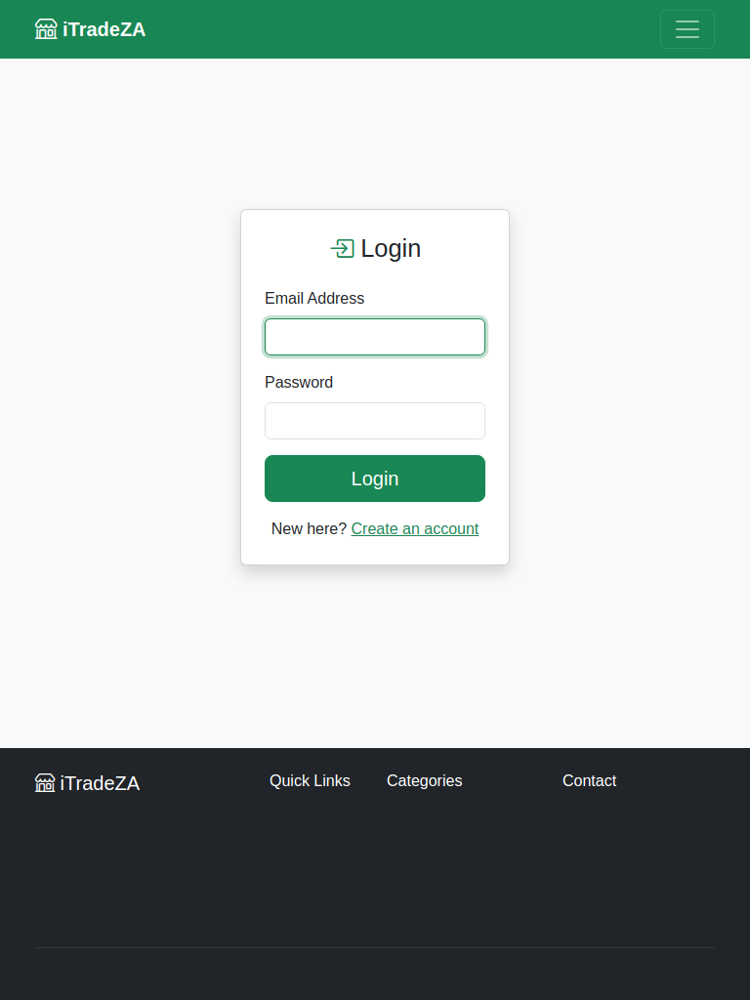 | 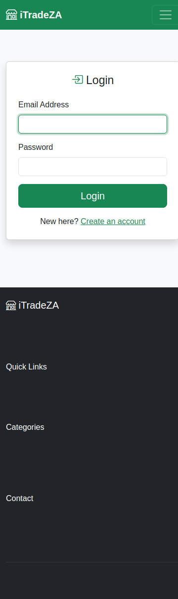 |

#### Registration Page

| Desktop | Tablet | Mobile |
|:---:|:---:|:---:|
| 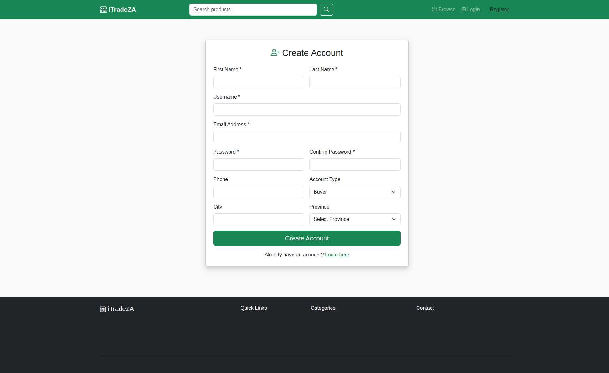 | 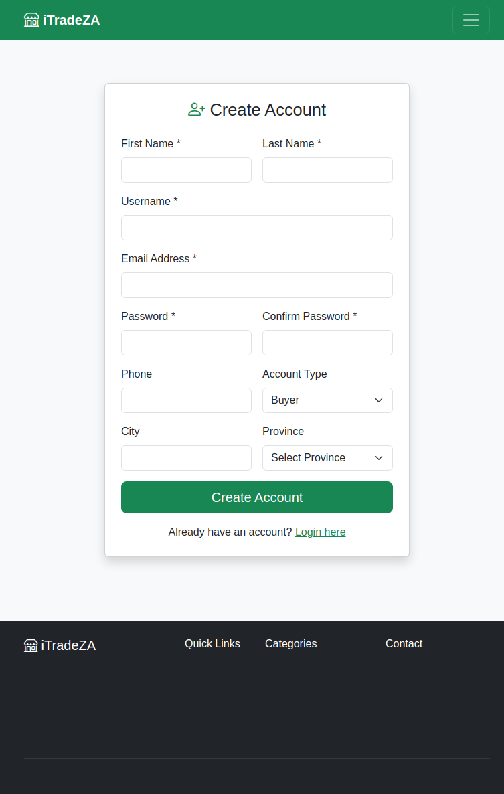 | 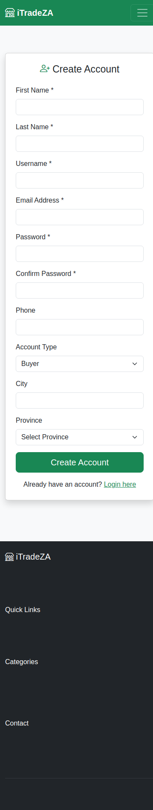 |

---

### b. Admin Website — Responsive Prototypes

| Dashboard (Desktop) | Users Management (Desktop) | Roles RBAC (Desktop) |
|:---:|:---:|:---:|
|  |  | 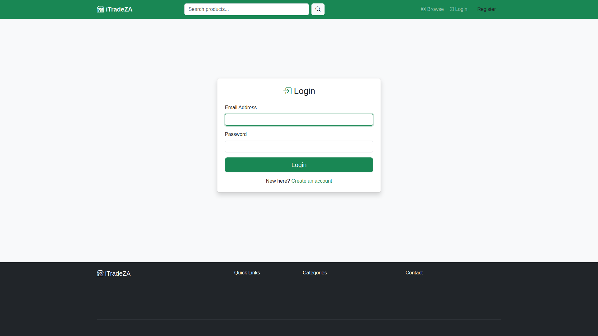 |

**Admin Panel Features:**
- Dark-themed navigation bar with "iTradeZA Admin" branding
- Collapsible left sidebar with icon navigation (Dashboard, Users, Products, Orders, Roles)
- 4 stats cards with real-time data (Total Users, Products, Orders, Revenue in ZAR)
- Responsive data tables with action buttons (Edit, Delete, View)
- Modal-based create/edit forms for all CRUD operations
- Role-Based Access Control enforcement — only users with `role_id=1` (admin) can access

---

## 2.3 Designing

### a. Class Responsibility Collaborator (CRC) Cards


**Detailed CRC Cards:**

| **Class: User** | |
|---|---|
| **Responsibilities:** | **Collaborators:** |
| Register with email, username, password | Role |
| Login/logout (session management) | Product |
| Update profile information | Order |
| Has a role (admin/seller/buyer) | Message |
| Manage cart items | Review |
| Place and track orders | Cart |

| **Class: Product** | |
|---|---|
| **Responsibilities:** | **Collaborators:** |
| Store title, description, price, condition, quantity | User (seller) |
| Belong to a category | Category |
| Have multiple images (up to 5) | ProductImage |
| Be listed by a seller | Cart |
| Have status (active/sold/inactive) | OrderItem |

| **Class: Order** | |
|---|---|
| **Responsibilities:** | **Collaborators:** |
| Record a completed purchase | User (buyer) |
| Track status (pending → paid → shipped → delivered) | User (seller) |
| Store payment method and shipping address | OrderItem |
| Calculate total amount in ZAR | Review |

| **Class: Cart** | |
|---|---|
| **Responsibilities:** | **Collaborators:** |
| Hold product selections for a buyer | User (buyer) |
| Track quantities per item | Product |
| Calculate subtotals | |
| Convert to order on checkout | Order |

| **Class: Message** | |
|---|---|
| **Responsibilities:** | **Collaborators:** |
| Enable buyer-seller communication | User (sender) |
| Track read/unread status | User (receiver) |
| Optionally reference a product | Product |
| Support real-time chat interface | |

| **Class: Role** | |
|---|---|
| **Responsibilities:** | **Collaborators:** |
| Define access level (admin/seller/buyer) | User |
| Control feature access via RBAC | Admin |
| Guard admin routes (requireAdmin()) | |

| **Class: Review** | |
|---|---|
| **Responsibilities:** | **Collaborators:** |
| Rate a seller (1–5 stars) | User (reviewer) |
| Store comment text | User (seller) |
| Link to a completed order | Order |

---

### b. Enhanced Entity Relationship Diagram (EERD)

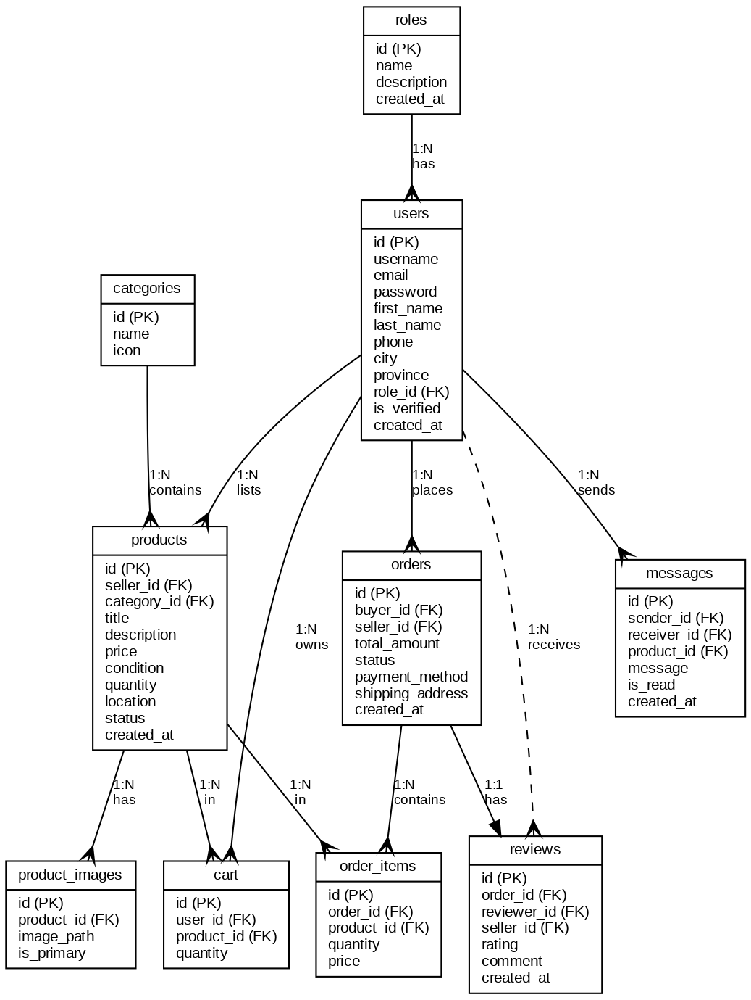

**Key Relationships:**
- **Roles 1:N Users** — A role has many users (disjoint, total participation)
- **Users 1:N Products** — A seller lists many products
- **Categories 1:N Products** — A category contains many products
- **Products 1:N Product_Images** — A product has up to 5 images
- **Users 1:N Cart** — A buyer has many cart items
- **Users 1:N Orders** — As both buyer and seller
- **Orders 1:N Order_Items** — An order contains multiple line items
- **Users 1:N Messages** — As sender and receiver
- **Orders 1:1 Reviews** — Each completed order can have one review

**Specialisation:** Users specialise into Admin, Seller, Buyer via the `role_id` FK (disjoint, total participation — every user has exactly one role).

---

### c. Context Diagram

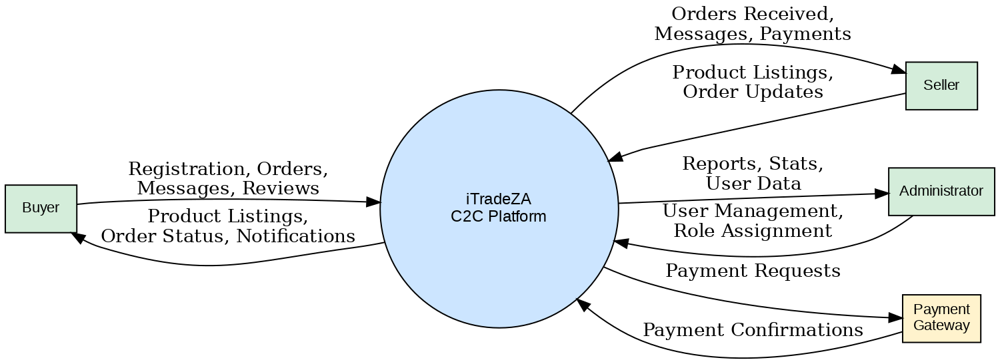

**External Entities:**
- **Buyer** — Registers, browses products, places orders, sends messages, leaves reviews
- **Seller** — Registers, lists products, manages orders, receives messages and payments
- **Administrator** — Manages users, roles, products, orders; views reports and statistics
- **Payment Gateway** — Processes payment requests (EFT, e-Wallet, Cash on Delivery, Card)

**Data Flows:**
- Buyer → System: Registration data, orders, messages, reviews, search queries
- System → Buyer: Product listings, order status, notifications, search results
- Seller → System: Product listings, order status updates
- System → Seller: Orders received, messages, payment notifications
- Admin → System: User management, role assignment, CRUD operations
- System → Admin: Reports, statistics, user data, audit logs

---

### d. Data Flow Diagram (DFD) — Level 1

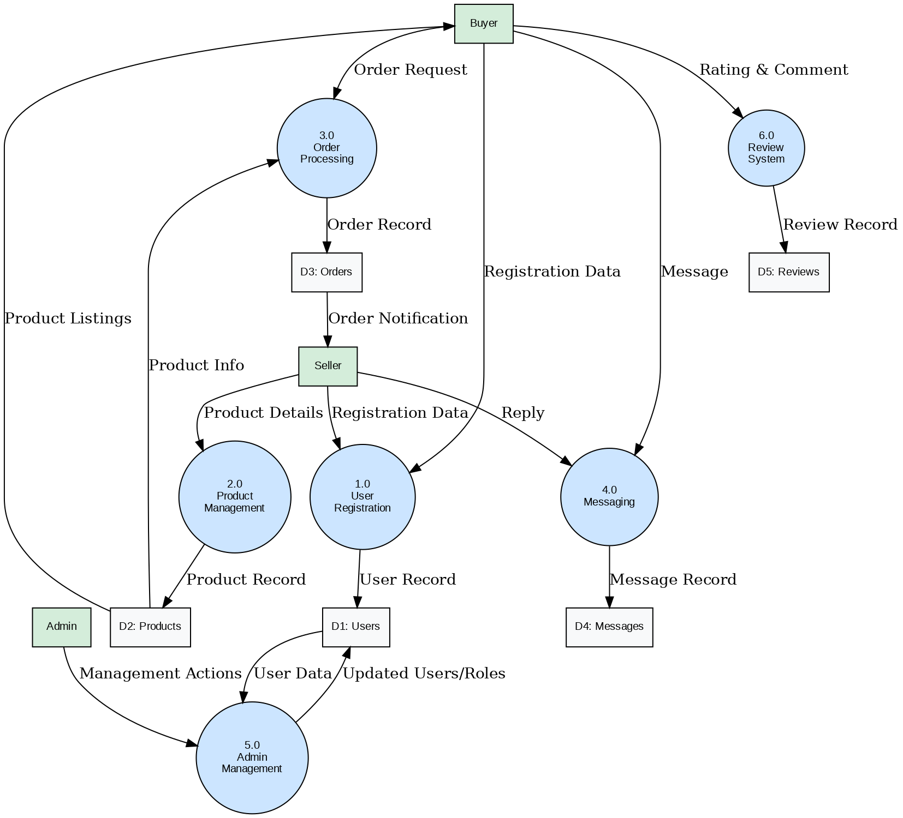

**Processes:**
1. **1.0 User Registration** — Handles new account creation with role assignment
2. **2.0 Product Management** — Manages product listings, images, categories
3. **3.0 Order Processing** — Handles cart → checkout → order creation → status tracking
4. **4.0 Messaging** — Facilitates buyer-seller communication
5. **5.0 Admin Management** — Provides CRUD operations and RBAC enforcement
6. **6.0 Review System** — Handles ratings and comments for completed orders

**Data Stores:**
- D1: Users (registration, authentication, profiles)
- D2: Products (listings, images, categories)
- D3: Orders (purchases, status, payments)
- D4: Messages (conversations, read status)
- D5: Reviews (ratings, comments)

---

### e. Use Case Diagram

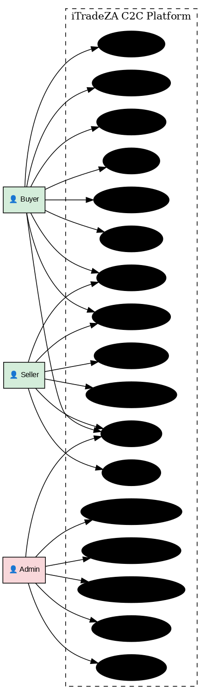

**Actors and Their Use Cases:**

| Actor | Use Cases |
|-------|-----------|
| **Buyer** | Register, Login/Logout, Browse Products, Search & Filter, Add to Cart, Checkout & Pay, Track Orders, Send Message, Leave Review |
| **Seller** | Register, Login/Logout, List Product, Manage Listings, Update Order Status, Send Message |
| **Admin** | Login/Logout, Manage Users (CRUD), Manage Roles (RBAC), View Dashboard/Reports, Manage Products, Manage Orders |

---

### f. Database Design (Schema)

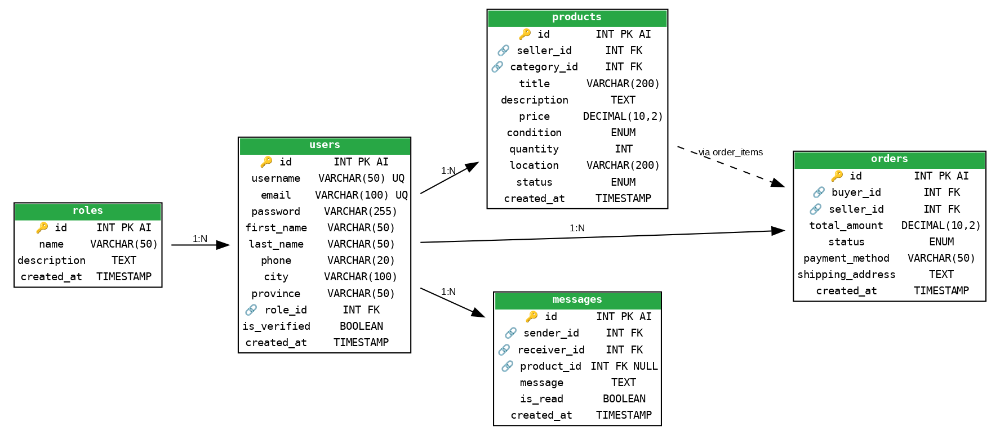

**Complete Schema (10 Tables):**

```sql
-- 1. Roles (RBAC)
CREATE TABLE roles (
    id INT PRIMARY KEY AUTO_INCREMENT,
    name VARCHAR(50) UNIQUE NOT NULL,
    description TEXT,
    created_at TIMESTAMP DEFAULT CURRENT_TIMESTAMP
);

-- 2. Users
CREATE TABLE users (
    id INT PRIMARY KEY AUTO_INCREMENT,
    username VARCHAR(50) UNIQUE NOT NULL,
    email VARCHAR(100) UNIQUE NOT NULL,
    password VARCHAR(255) NOT NULL,
    first_name VARCHAR(50),
    last_name VARCHAR(50),
    phone VARCHAR(20),
    city VARCHAR(100),
    province VARCHAR(50),
    role_id INT DEFAULT 3,
    is_verified BOOLEAN DEFAULT FALSE,
    created_at TIMESTAMP DEFAULT CURRENT_TIMESTAMP,
    FOREIGN KEY (role_id) REFERENCES roles(id)
);

-- 3. Categories
CREATE TABLE categories (
    id INT PRIMARY KEY AUTO_INCREMENT,
    name VARCHAR(100) NOT NULL,
    icon VARCHAR(50)
);

-- 4. Products
CREATE TABLE products (
    id INT PRIMARY KEY AUTO_INCREMENT,
    seller_id INT NOT NULL,
    category_id INT,
    title VARCHAR(200) NOT NULL,
    description TEXT,
    price DECIMAL(10,2) NOT NULL,
    `condition` ENUM('new','used','refurbished') DEFAULT 'used',
    quantity INT DEFAULT 1,
    location VARCHAR(200),
    status ENUM('active','sold','inactive') DEFAULT 'active',
    created_at TIMESTAMP DEFAULT CURRENT_TIMESTAMP,
    FOREIGN KEY (seller_id) REFERENCES users(id),
    FOREIGN KEY (category_id) REFERENCES categories(id)
);

-- 5. Product Images
CREATE TABLE product_images (
    id INT PRIMARY KEY AUTO_INCREMENT,
    product_id INT NOT NULL,
    image_path VARCHAR(255) NOT NULL,
    is_primary BOOLEAN DEFAULT FALSE,
    FOREIGN KEY (product_id) REFERENCES products(id) ON DELETE CASCADE
);

-- 6. Cart
CREATE TABLE cart (
    id INT PRIMARY KEY AUTO_INCREMENT,
    user_id INT NOT NULL,
    product_id INT NOT NULL,
    quantity INT DEFAULT 1,
    FOREIGN KEY (user_id) REFERENCES users(id),
    FOREIGN KEY (product_id) REFERENCES products(id),
    UNIQUE KEY unique_cart_item (user_id, product_id)
);

-- 7. Orders
CREATE TABLE orders (
    id INT PRIMARY KEY AUTO_INCREMENT,
    buyer_id INT NOT NULL,
    seller_id INT NOT NULL,
    total_amount DECIMAL(10,2) NOT NULL,
    status ENUM('pending','paid','shipped','delivered','cancelled') DEFAULT 'pending',
    payment_method VARCHAR(50),
    shipping_address TEXT,
    created_at TIMESTAMP DEFAULT CURRENT_TIMESTAMP,
    FOREIGN KEY (buyer_id) REFERENCES users(id),
    FOREIGN KEY (seller_id) REFERENCES users(id)
);

-- 8. Order Items
CREATE TABLE order_items (
    id INT PRIMARY KEY AUTO_INCREMENT,
    order_id INT NOT NULL,
    product_id INT NOT NULL,
    quantity INT NOT NULL,
    price DECIMAL(10,2) NOT NULL,
    FOREIGN KEY (order_id) REFERENCES orders(id),
    FOREIGN KEY (product_id) REFERENCES products(id)
);

-- 9. Messages
CREATE TABLE messages (
    id INT PRIMARY KEY AUTO_INCREMENT,
    sender_id INT NOT NULL,
    receiver_id INT NOT NULL,
    product_id INT,
    message TEXT NOT NULL,
    is_read BOOLEAN DEFAULT FALSE,
    created_at TIMESTAMP DEFAULT CURRENT_TIMESTAMP,
    FOREIGN KEY (sender_id) REFERENCES users(id),
    FOREIGN KEY (receiver_id) REFERENCES users(id),
    FOREIGN KEY (product_id) REFERENCES products(id)
);

-- 10. Reviews
CREATE TABLE reviews (
    id INT PRIMARY KEY AUTO_INCREMENT,
    order_id INT NOT NULL,
    reviewer_id INT NOT NULL,
    seller_id INT NOT NULL,
    rating INT NOT NULL CHECK (rating BETWEEN 1 AND 5),
    comment TEXT,
    created_at TIMESTAMP DEFAULT CURRENT_TIMESTAMP,
    FOREIGN KEY (order_id) REFERENCES orders(id),
    FOREIGN KEY (reviewer_id) REFERENCES users(id),
    FOREIGN KEY (seller_id) REFERENCES users(id)
);
```

---

## 2.4 Coding

### a. Screenshots

#### Main Website Screenshots

| Home Page | Product Browse | Product Detail |
|:---:|:---:|:---:|
|  |  |  |

| Registration | Login | Admin Dashboard |
|:---:|:---:|:---:|
|  |  |  |

---

### b. Sample PHP Code

#### Authentication — Login (`auth/login.php`)
```php
<?php
$pageTitle = 'Login';
require_once __DIR__ . '/../includes/functions.php';

if ($_SERVER['REQUEST_METHOD'] === 'POST') {
    $email    = trim($_POST['email'] ?? '');
    $password = $_POST['password'] ?? '';

    $pdo = getDBConnection();
    $stmt = $pdo->prepare("SELECT id, username, password, role_id FROM users WHERE email = ?");
    $stmt->execute([$email]);
    $user = $stmt->fetch();

    if ($user && password_verify($password, $user['password'])) {
        $_SESSION['user_id']  = $user['id'];
        $_SESSION['username'] = $user['username'];
        $_SESSION['role_id']  = $user['role_id'];
        setFlash('success', 'Welcome back, ' . sanitize($user['username']) . '!');
        header('Location: ' . SITE_URL . '/');
        exit;
    } else {
        $error = 'Invalid email or password.';
    }
}
```
**Purpose:** Handles user authentication with `password_verify()` for bcrypt hash comparison. Sets session variables for role-based access control.

#### Role-Based Access Control (`includes/functions.php`)
```php
function requireAdmin(): void {
    requireRole('admin');
}

function requireRole(string $role): void {
    requireLogin();
    if (getUserRole() !== $role) {
        header('HTTP/1.1 403 Forbidden');
        echo '<h1>403 – Access Denied</h1>';
        exit;
    }
}

function getUserRole(): string {
    $pdo = getDBConnection();
    $stmt = $pdo->prepare("SELECT r.name FROM roles r JOIN users u ON u.role_id = r.id WHERE u.id = ?");
    $stmt->execute([$_SESSION['user_id']]);
    return $stmt->fetchColumn() ?: '';
}
```
**Purpose:** Implements RBAC by checking user roles before granting access to restricted pages. Used as a guard at the top of every admin route.

---

### c. Sample HTML Code

#### Product Card Component (Bootstrap 5)
```html
<div class="col-md-4 mb-4">
    <div class="card product-card h-100 shadow-sm">
        " class="card-img-top" 
             alt="<?php echo sanitize($product['title']); ?>">
        <div class="card-body d-flex flex-column">
            <span class="badge bg-success mb-2"><?php echo sanitize($product['category_name']); ?></span>
            <h6 class="card-title"><?php echo sanitize($product['title']); ?></h6>
            <p class="text-success fw-bold mt-auto">
                R <?php echo number_format($product['price'], 2); ?>
            </p>
            <small class="text-muted">
                <i class="bi bi-geo-alt"></i> <?php echo sanitize($product['location']); ?>
            </small>
        </div>
        <div class="card-footer bg-white border-0">
            <a href="view.php?id=<?php echo $product['id']; ?>" 
               class="btn btn-success btn-sm w-100">View Details</a>
        </div>
    </div>
</div>
```
**Purpose:** Responsive product card using Bootstrap 5 grid system. Displays product image, category badge, title, ZAR price, location, and action button.

---

### d. Sample JavaScript Code

#### Cart Functionality (`assets/js/main.js`)
```javascript
$(document).ready(function() {
    // Update cart quantity via AJAX
    $('.quantity-input').on('change', function() {
        const cartId = $(this).data('cart-id');
        const quantity = $(this).val();
        
        $.post('/cart/cart.php', {
            update_quantity: true,
            cart_id: cartId,
            quantity: quantity
        }, function(response) {
            location.reload(); // Refresh to update totals
        });
    });
    
    // Real-time search with debounce
    let searchTimer;
    $('#searchInput').on('input', function() {
        clearTimeout(searchTimer);
        const query = $(this).val();
        searchTimer = setTimeout(function() {
            if (query.length >= 2) {
                window.location.href = '/products/browse.php?search=' + encodeURIComponent(query);
            }
        }, 500);
    });
});
```
**Purpose:** jQuery-based cart management and search functionality with debouncing for performance.

---

### e. Sample CSS Code

#### Custom Styling (`assets/css/style.css`)
```css
/* Product card hover effect */
.product-card {
    transition: transform 0.2s ease, box-shadow 0.2s ease;
    border: none;
    border-radius: 12px;
    overflow: hidden;
}
.product-card:hover {
    transform: translateY(-5px);
    box-shadow: 0 8px 25px rgba(0,0,0,0.1) !important;
}

/* South African themed color scheme */
:root {
    --primary-green: #28a745;
    --dark-green: #1e7e34;
    --gold-accent: #ffc107;
}

/* Chat message bubbles */
.chat-bubble-sent {
    background-color: var(--primary-green);
    color: white;
    border-radius: 18px 18px 4px 18px;
    padding: 10px 15px;
    max-width: 75%;
}
.chat-bubble-received {
    background-color: #f1f1f1;
    border-radius: 18px 18px 18px 4px;
    padding: 10px 15px;
    max-width: 75%;
}

/* Responsive utilities */
@media (max-width: 768px) {
    .hero-section h1 { font-size: 1.8rem; }
    .category-grid { grid-template-columns: repeat(2, 1fr); }
    .admin-sidebar { display: none; }
}
```
**Purpose:** Custom CSS extending Bootstrap 5 with hover effects, South African themed colours, chat bubble styling, and responsive breakpoints.

---

### f. Sample MySQL Table Screenshots

**MySQL Tables in the `itradeza_c2c` Database:**

The database contains 10 tables with proper foreign key relationships:

| Table | Purpose | Key Fields |
|-------|---------|-----------|
| `roles` | RBAC role definitions | id, name, description |
| `users` | All registered users | id, email, password, role_id (FK) |
| `categories` | Product classification | id, name, icon |
| `products` | Seller listings | id, seller_id (FK), price, condition |
| `product_images` | Multi-image support | id, product_id (FK), image_path |
| `cart` | Shopping cart items | user_id (FK), product_id (FK), quantity |
| `orders` | Purchase records | buyer_id (FK), seller_id (FK), status |
| `order_items` | Order line items | order_id (FK), product_id (FK), price |
| `messages` | Buyer-seller chat | sender_id (FK), receiver_id (FK) |
| `reviews` | Seller ratings | rating CHECK(1-5), order_id (FK) |

**Key Constraints:**
- All tables use `INT AUTO_INCREMENT` primary keys
- Foreign keys enforce referential integrity
- `UNIQUE KEY` on cart prevents duplicate items
- `CHECK` constraint on reviews ensures ratings are 1–5
- `ENUM` fields for status and condition restrict valid values
- Indexes on frequently queried columns (email, seller_id, category_id)

---

## 2.5 Conclusion

The design and development phase of iTradeZA demonstrates a comprehensive understanding of database-driven web application development for the C2C e-commerce domain. The platform successfully implements:

- **Full CRUD functionality** across all entities (users, products, orders, messages, reviews)
- **Role-Based Access Control (RBAC)** with three defined roles and enforced permission boundaries
- **Responsive design** verified across desktop, tablet, and mobile viewports
- **South African localisation** with ZAR currency formatting, local payment methods, and province selection
- **Secure authentication** with bcrypt password hashing and prepared SQL statements
- **Professional UX** with Bootstrap 5 components, real-time chat, and intuitive navigation

The system architecture follows the MVC pattern with PHP as the controller/model layer, MySQL as the data store, and HTML/CSS/JavaScript as the view layer — all meeting the technical requirements outlined in the project specification.

---

*End of Deliverable 2*
